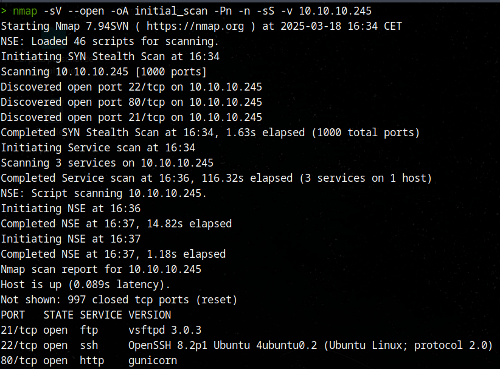
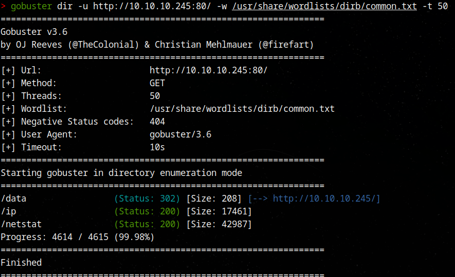
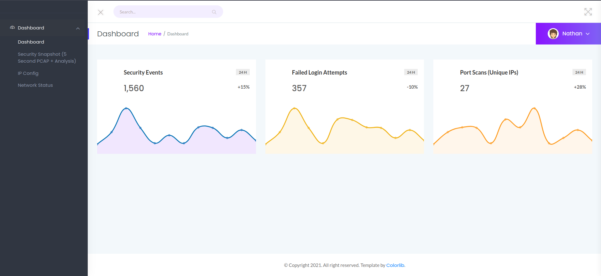
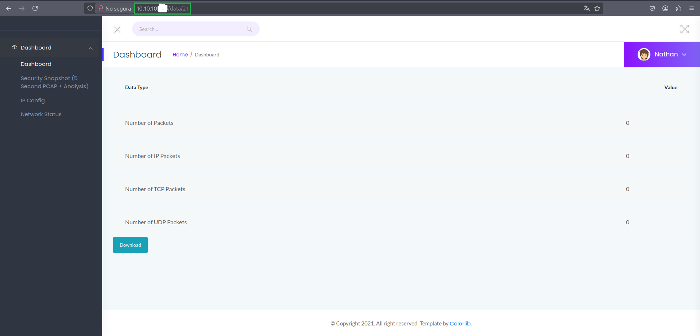
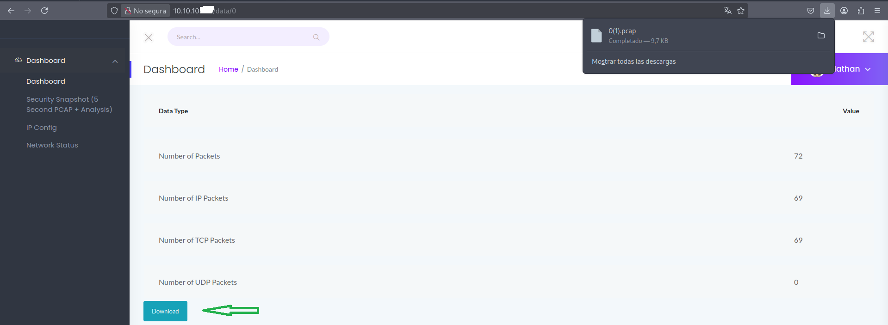
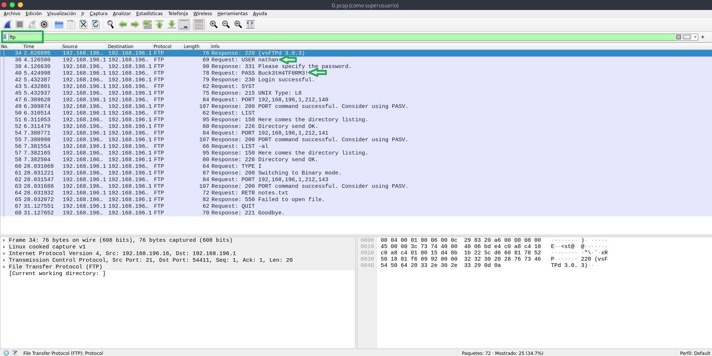
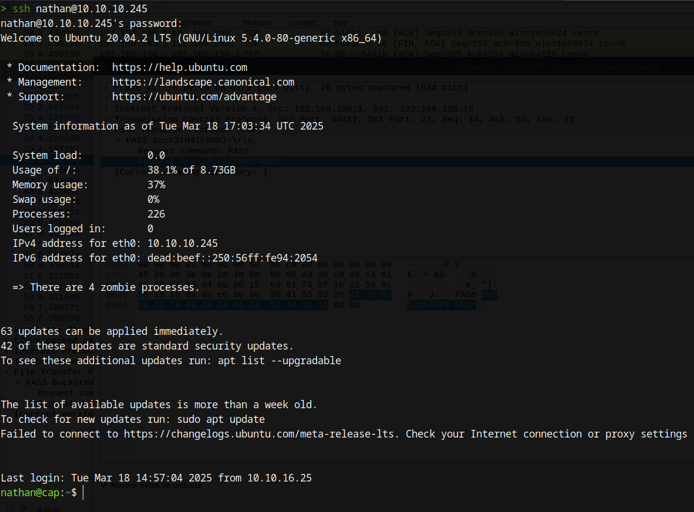

# Explotación Web - IDOR

# Índice - Explotación Web IDOR

- [Fase 1 - Enumeración](#fase-1---enumeración-de-servicios-puertos-y-dominios)
  - [Escaneo con Nmap](#1-nmap)
  - [Enumeración con Gobuster](#2-gobuster)
- [Fase 2 - Explotación de IDOR](#fase-2---explotación-de-idor)
  - [Modificación del 'id'](#3-modificación-de-id)
  - [Análisis con Wireshark](#4-análisis-wireshark)
- [Fase 3 - Acceso con credenciales](#fase-3---probar-credenciales-para-ganar-acceso)

## Leyenda

[i] Información adicional  
[!] Advertencia o dato a destacar  
[+] Acción o hallazgo positivo  


## Fase 1 - Enumeración de servicios, puertos y dominios

### 1. Nmap

```bash
nmap -sV --open -oA initial_scan -Pn -n -sS -v 10.10.10.245
```



---

[!] Se identifican varios puertos abiertos. Procedemos a un escaneo más detallado en los más relevantes.

```bash
nmap -sC -sV -n -Pn -sS -p21,22,80 10.10.10.245 -v
```

[!] Obtenemos información relevante, destacamos dos elementos:

	http-server-header: **gunicorn**
	|  
	|
	|_http-title: **Security Dashboard**
	
[i] El encabezado "http-server-header: gunicorn" especifica qué servidor web está manejando las solicitudes HTTP. En este caso, muestra gunicorn, que es un servidor WSGI (Web Server Gateway Interface) comúnmente utilizado para aplicaciones Python

[i] "http-title: Security Dashboard" especifica que el título de la página es Security Dashboard, lo que nos da una idea de la función de la página o aplicación. Esto puede ser útil para ubicarnos dentro de la aplicación y saber que estamos en una página de tipo "dashboard" de seguridad

[i] Un Security Dashboard es una interfaz web que muestra información sobre el estado de seguridad de un sistema o red, incluyendo estadísticas, alertas y eventos, y puede ser un punto clave para identificar vulnerabilidades si está mal configurado.


---

### 2. Gobuster

```bash
gobuster dir -u http://10.10.10.245:80/ -w /usr/share/wordlists/dirb/common.txt -t 50
```
**Posible resultado:**



[+] Al navegar a la ruta IP:80 o clickando en la primera ruta que nos muestra gobuster vemos el siguiente panel web:



[+] Si navegamos por los diferentes apartados de la web y vemos que en el apartado **Security Snapshot (5 Second PCAP + Analysis)** su URL muestra información interesante, analicémosla:

	[i]  En la URL el formato que vemos es IP/[data]/[id], donde [id] representa el número de identificación del escaneo.

	[i] Este formato sugiere la posible presencia de una vulnerabilidad IDOR (Insecure Direct Object Reference), que permite modificar la URL (el parámetro 'id') para acceder a registros no autorizados. Dependiendo de la implementación, esto podría permitir acceder a datos de otros usuarios.



---

## Fase 2 - Explotación de IDOR

### 3. Modificación de 'id'

[+] Para comprobar que estamos ante una vulnerabilidad IDOR, probamos a modificar manualmente la URL, en lo que respecta al valor 'id'. Podemos probar con valores como 1, 2, 3 y ver qué ocurre. También probamos el valor 0.

[i] Vemos que por cada valor de 'id' introducido, los valores que muestra la web cambian.

[i] Por intuición accedemos a la 'id' de valor '0' y procedemos a darle a 'descargar' (como vemos en la imagen)



### 4. Análisis Wireshark

[i] Como el archivo descargado tiene un formato `.pcap` lo abrimos con Wireshark para su análisis.

[+] Dentro de Wireshark podemos usar el filtro `ftp`. O directamente navegar por los diferentes paquetes que vemos e identificar por su color azul aquellos paquetes que muestran información sensible.

[i] Filtramos los paquetes usando el protocolo FTP en Wireshark para localizar las credenciales transmitidas sin cifrado.



[i] Una vez localizado el paquete sensible (vemos campos como **'USER'** y **'PASS'**, por lo que haciendo doble click sobre ellos y desplegando (como se ve en la imagen) el apartado 'File Transfer Protocol (FTP)' podemos con click derecho desplegar un menú que nos permite copiar el valor mostrado.


## Fase 3 - Probar credenciales para ganar acceso

[i] Como anteriormente descubrimos la existencia del servicio `ssh` operativo, podemos probar las credenciales obtenidas vía `ssh`

```bash
ssh nathan@IP_objetivo
```

[i] Tras ejecutar el anterior comando nos debería pedir una contraseña. Aquí probamos la credencial PASS obtenida desde Wireshark

[i] Si las credenciales son correctas, acabamos de ganar acceso a la 'máquina víctima' lo vemos en el promp que se nos proporciona tras introducir la contraseña correcta. Por lo que comenzaría aquí una nueva fase de nuestro ejercicio de pentesting.


